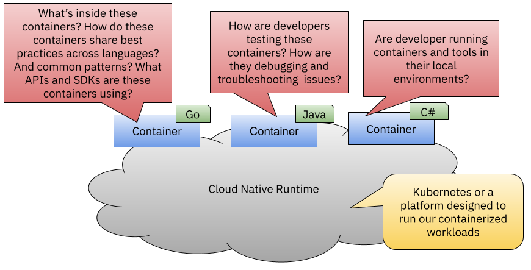
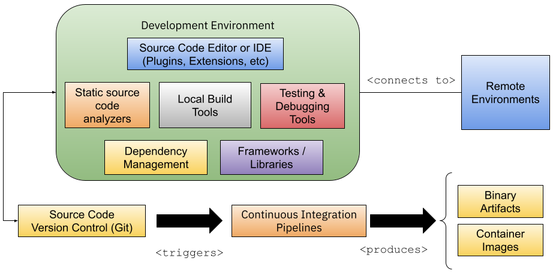

# Application Development Working Group - Charter

The charter describes the mission and tactics of the Application Development Working Group (WG). 

## Introduction

The cloud computing boom of the past decade has driven an explosion of new development tools and practices. Developers once had complete control over how their code ran locally. However, shifting to cloud-based testing and deployment practices in remote environments (in the public and private cloud) requires a different approach. Teams are now tasked to navigate the complexities of architecting distributed systems and accept the inherent overhead of working with complex environments.

The rise of cloud-native runtimes (including Kubernetes and containers) revolutionized how teams build, package, and deploy software. This technology allows applications to scale seamlessly across cloud providers and on-premises environments. Now, thanks to the Open Container Initiative (OCI) standard and OCI runtimes, developers can leverage the same containerized approach for remote environments and their local development workflows, creating a more consistent experience.

Containers helped to streamline bootstrapping application infrastructure. Databases, message brokers, and other services can be spun up quickly alongside your code. Tools like Docker Compose, which is agnostic to programming language, allow developers to define their application and its dependencies in a single file. While containers simplify deployment, crafting production-ready, secure images requires more effort than creating a basic Dockerfile. While other teams often package and distribute these containers, developers must understand how to design and leverage best practices for containerized workloads correctly.

Popular programming languages and communities, including Go, C#, Java, DotNet, Javascript (Node.js), and Rust, have embraced common patterns and best practices to create applications that will run as containers. This means that regardless of your language choice, frameworks, and tools exist to help developers follow well-established principles like the “12-factor principles” (https://12factor.net). These principles align with the container’s best practices, simplifying the transition and ensuring your applications are designed from the ground up to run on  cloud-native runtime environments.

Developing complex and distributed applications introduces challenges for inner-loop development practices and directly impacts developers’ productivity. The mismatch between development and production environments adds unnecessary complexities to developer workflows and pushes teams to develop different approaches to accelerate their feedback loops. Several options exist to bridge the gap:

- Local cloud-native runtime: a scaled-down version of the runtime is provided for developers to run locally in their workstations. 
  - Using Kubernetes as the base for a cloud-native runtime, teams can run a scaled-down Kubernetes cluster locally with enough services to mimic production behavior for development tasks. Tools like MiniKube, KinD, and K3s are popular in this space. 
- Ephemeral (remote) cloud-native runtime: a virtual scaled-down environment can be provisioned on-demand for a team to work on their development tasks. These environments are easy to create and easy to dispose of when they are no longer needed.
  - If Kubernetes is being used, a platform team will be in charge of making the process simple and cost-efficient. 
- Full remote cloud-native runtime: provide developers access to remote cloud-native runtime, where all the tools needed for their tasks are hosted remotely.
  - Similar to cloud provider tooling, tools, including Kubernetes clusters, build tools, and code editors (IDEs), can all be hosted remotely, removing the need for developers to install tools locally. 

Depending on the context, these options can improve the development experience but still expose some inherent complexity of the cloud-native runtime environment of choice (for example, Kubernetes). 

Indeed, there's no one-size-fits-all solution, and teams must combine tools and different approaches to achieve an efficient inner development loop. This fragmented approach, complex development environments, and the development-to-production gap create friction and hinder developer productivity. Teams face real-life challenges, such as: 
- Onboarding new team members becomes challenging due to the high learning curve.
- Researching different tools and approaches is a full-time job usually performed by other teams (such as platform teams)
- How to enable developers across languages with out-of-the-box capabilities that they can use in their applications.

While the rise of Kubernetes and containers has equipped teams with container orchestration expertise, a significant gap remains:  industry-wide standards for promoting applications across diverse environments. Standardization is crucial for protecting investments and justifying tooling choices.  For instance, the consistency of Kubernetes APIs across cloud providers allows teams to leverage their container orchestration skills regardless of the chosen cloud provider.  Similarly, the OpenTelemetry specification and tools provide a vendor-neutral approach to defining observability stacks based on the selected environment. However, the industry lacks a unified approach regarding application-level APIs, SDKs, and tools that can be used from different languages. This lack of shared best practices, APIs, and standards creates challenges and generates a lot of work that lands on cloud-native developers and architects' shoulders.

## Mission

The following sections describe the focus of the working group, its core responsabilities and the areas that are out of scope. 

## Responsibilities & Deliverables

Cloud-native developers and architects face a double threat: fragmented tooling landscapes and limited awareness of cross-language solutions. This combination creates a time-consuming roadblock – wasting valuable effort to find the right tools for common programming challenges.

This working group aims to empower cloud-native developers and architects by identifying and promoting common practices and tooling for enhancing the inner development loop. One of the objectives will be to provide an overview of categorized tools. Each tool, best practice, and standard the working group covers will highlight real-world case studies, suggestions, and content to help teams move faster. The key categories are below:

- Development Environment:
  - Code Editors & IDEs (including Cloud-based options)
  - Plugins & Extensions
- Build & Automation (Local):
  - Build Tools
  - Containerization Tools
- Testing & Debugging:
  - Local & Remote Testing Tools
  - Debugging Tools (including Profiling)
- Code Quality & Standards:
  - Linters & Formatters
  - Static Code Analysis Tools
  - API Standards & Compliance Tools
- Cloud Native Development:
  - APIs & SDKs/CLIs for Cloud Services
  - Standards that developers can adopt
  - Polyglot Development Support Tools

The following diagram illustrates common tools, tasks, and artifacts in developer workflows.

In addition to uncovering tools, this group should champion best practices for building developer experiences (DevEx) that enhance productivity and minimize cognitive load. This includes promoting tools that integrate seamlessly within existing workflows and empowering teams to design custom interfaces tailored to domain-specific needs.

### Areas In-Scope

A core objective of this group is to identify and promote existing tools, standards, and practices within the CNCF ecosystem. By showcasing how these elements work together, we aim to map how existing tools and standards can enhance and complement practices and tools already familiar to developers and architects.

In addition to identifying best practices, this group should champion open-source tools that promote seamless integration between development tools and adopt standards. These tools empower teams to construct custom interfaces tailored to their specific domains, ultimately reducing cognitive load and boosting developer productivity.

The following list of goals will drive the working group agenda:

- Identify and promote developer productivity tools within the cloud-native ecosystem. Raise awareness and facilitate the adoption of tools supporting and enhancing developer workflows in the cloud-native space.
- Promote interoperability and standards across tools. Leverage shared APIs and SDKs across the industry to map the development ecosystem, document existing functionalities, and pinpoint areas for improvement.
- Advocate for developer experience (DevEx) tools that streamline cloud-native development workflows.
Assist with the organization of AppDeveloperCon, reviewing and proposing topics.
- Identify how tools contribute to improving developer productivity metrics.
- Provide early feedback and recommendations for projects and tools seeking CNCF adoption around cloud-native app development. 

### Areas Out of Scope

These are topics or initiatives that this WG will not target and work on. We might add new items or update this list if we find projects, standards, or initiatives this WG finds interesting to work on in future iterations. 
- Create new standards.
- Define how application development should be done.
- Creation of a new CNCF open-source project.
- Promote tools that are only useful for a specific stack/programming language.
- Promote adopting security best practices throughout the development lifecycle, secure coding standards, and vulnerability scanning to mitigate risks and protect applications from potential threats.
- Promote sustainability and efficiency in application development and tooling to optimize resource utilization and minimize environmental impact.

### Deliverables to the TAG

This working group aims to bring developers closer to the App Delivery TAG. Creating resources and collaborating on initiatives that matter to cloud-native developers and architects. Concrete initiatives and deliverables that this working group will concentrate on: 

Complementing the CNCF landscape with a view targeted for cloud-native developers and architects
Complementing the Platform WG Glossary for Application Development
Complementing other working groups under the TAG App Delivery personas definitions
Helping with the organization and selection of proposals for AppDeveloperCon

## Interface with other TAGs and Interested parties

While this group focuses purely on developers and application architects, it coordinates with the TAG App Delivery and the Platform Working Group on important topics such as developers' experience, shared tools, and interfaces that help facilitate communications and operations across different teams. 

Aligning common terms (glossary) and personas is fundamental to ensure that the work produced by this Working Group makes the ecosystem easier to understand.

This group also interacts with the Sustainability TAG regarding the efficiency in application development and tooling to optimize resource utilization and minimize environmental impact. This group interacts with the TAG Security WG for security and supply chain-related topics.
