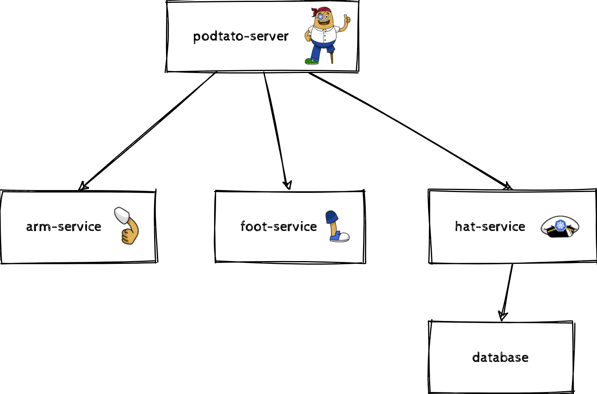
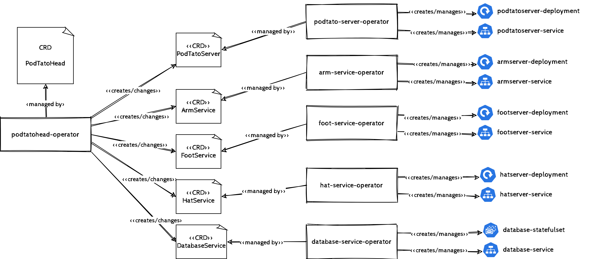

**Status**: WIP | **Maintainer** : N/A | 

## Best Practices
**(Current) Issue: https://github.com/cncf/sig-app-delivery/issues/44**

Over time, lots of best practices for writing operators have been published by various sources. Following, some of theses sources are mentioned and parts of them described based on a scenario.

Scenario: A microservice application ("The PodTato Head", https://github.com/cncf/podtato-head) should be entirely managed via operators (even if another deployment mechanism would make more sense). This application consists of 4 services and 1 database which can be illustrated as follows:

Best practices should be applied to this application deployment.

### An operator should manage a single type of application and multiple operators should be written for each component of an application 
(Sources: https://github.com/operator-framework/community-operators/blob/master/docs/best-practices.md, https://cloud.google.com/blog/products/containers-kubernetes/best-practices-for-building-kubernetes-operators-and-stateful-apps)

The features an operator provides, should be specific to a single application. Applied to our example, this means that there should be 5 operators which will manage one component (podtato-server, arm-service, foot-service, hat-service and the database) at a time. This provides a good separation of concerns for all of them (based on https://cloud.google.com/blog/products/containers-kubernetes/best-practices-for-building-kubernetes-operators-and-stateful-apps).

### Writing operators that represent a whole stack
(Sources: https://github.com/operator-framework/community-operators/blob/master/docs/best-practices.md)

Even if there is an operator for every part of the application, it might be easier to manage the whole stack in one CRD. If this is the case, an operator which represents the whole stack should delegate the work to the other operators for the more specific parts.

Technically, there would be a custom resource definition for the whole stack managed by an operator. This operator creates a custom resource for each of the components of the stack which are again managed by operators and managing the underlying resources.

### Multiple CRDs per controller
Every CRD managed by an operator should be implemented in a single controller. This makes code a bit more readable and should help with separation of concerns.

More best practices regarding operator creation could be found on following sources:
* https://github.com/operator-framework/community-operators/blob/master/docs/best-practices.md
* https://cloud.google.com/blog/products/containers-kubernetes/best-practices-for-building-kubernetes-operators-and-stateful-apps
    
